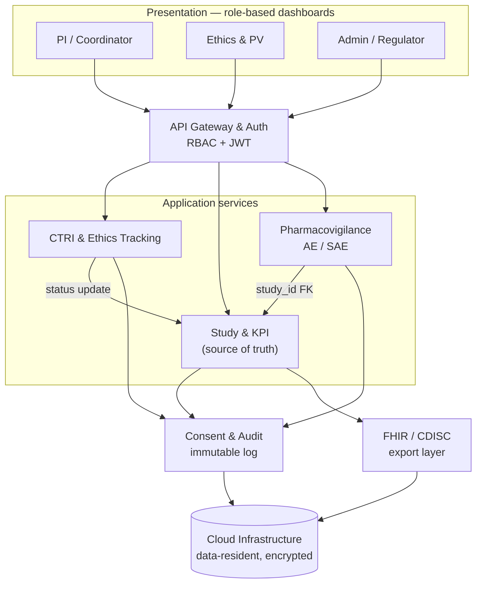
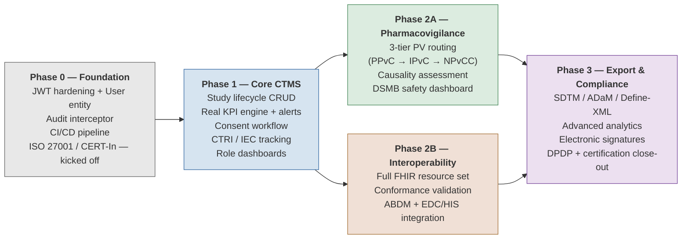

# AIIA Clinical Trials Dashboard — MVP

A cloud-based Clinical Trial Management System (CTMS) for the All India Institute of Ayurveda, giving a single, role-based, auditable view of its clinical-research portfolio — study lifecycle tracking, KPIs/alerts, ethics/CTRI milestones, and pharmacovigilance (AE/SAE) reporting.

> Built for Problem Statement 26046 (Ministry of Ayush / AIIA). This README documents the **5-day MVP scope** — a scoped-down slice of the full solution described in the problem statement, built on synthetic data only.

---

## 1. Architecture



### Services

| Service | What it does | Depends on |
|---|---|---|
| **API Gateway & Auth** | Entry point for every request; validates JWT, attaches role context, routes onward | — |
| **Study & KPI** (hub) | Owns study/site/enrolment data, lifecycle status, and computes KPIs (enrolment lag, overdue visits, milestone due dates) | — (source of truth) |
| **CTRI & Ethics Tracking** | Tracks IEC approval and CTRI registration milestones; pushes status updates onto the parent study | Study & KPI (`study_id`) |
| **Pharmacovigilance** | Captures AE/ADR/SAE reports against a study/subject, tracks regulatory reporting deadlines | Study & KPI (`study_id`, subject ref) |
| **Consent & Audit** | Captures informed consent; writes an immutable, timestamped log of every create/update/delete across the system | Listens to all write paths |
| **FHIR / CDISC export layer** | Read-only transform layer; reshapes internal data into FHIR R4 (`ResearchStudy`) / CDISC-shaped exports | Study & KPI (reads only) |

**Stack:** Spring Boot 3.2 (Java 17), Spring Data JPA, Spring Security + JWT, H2 (local dev) / PostgreSQL (deploy), Lombok, DataFaker (synthetic seed data), HAPI FHIR (for the export layer).

---

## 2. Compliance scope — what's real vs. simulated in this MVP

Being upfront about this matters more than pretending everything is production-grade:

| Area | Real in this MVP | Simulated / stubbed |
|---|---|---|
| RBAC, audit trail, consent capture | ✅ Fully real | — |
| Study/KPI/enrolment tracking | ✅ Fully real | — |
| CTRI registration number | Stored as a field | Not submitted to CTRI (no public submission API exists) |
| IEC approval workflow | Status/state modeled | Not an actual IEC review |
| MedDRA / WHO Drug coding | Field structure modeled | Uses a small placeholder code list (both dictionaries are paid/licensed) |
| FHIR R4 shape | ✅ Real HL7 FHIR R4 JSON via HAPI FHIR | Not connected to a live ABDM/EDC system |
| ISO 27001 / CERT-In hosting | Data-resident host + encryption | Not a certified/audited deployment |

---

## 3. Build phases (5-day MVP)

### Day 1 — Setup & data model (all 4 builders)
- [ ] Repo, cloud project, CI skeleton, env config
- [ ] DB schema: `User`, `Study`, `Site`, `EnrollmentRecord`, `AuditLog` (done — see `/src/main/java/com/aiia/ctms/model`)
- [ ] Auth approach: JWT + role claims
- [ ] Synthetic seed data generator (DataFaker) — studies, sites, subjects
- [ ] Basic hosting/deploy pipeline stood up

### Day 2 — Core backend build (backend-heavy)
- [ ] Study/site CRUD + RBAC middleware (backend owner)
- [ ] Enrolment tracking endpoints
- [ ] KPI calculation engine (enrolment vs. target, overdue visits, milestone due dates)
- [ ] Audit-trail logging (write interceptor on all entity changes)
- [ ] Alert rule engine (enrolment lag, overdue visit, approval due)
- [ ] Deployment automation + DB seeded with synthetic records

### Day 3 — API freeze + frontend kickoff
- [ ] Freeze and document APIs (Postman/OpenAPI export)
- [ ] KPI aggregation endpoint (`GET /studies/{id}/kpis`)
- [ ] Frontend: login screen, study list, API integration layer begins

### Day 4 — Frontend build-out
- [ ] KPI dashboard (cards/charts)
- [ ] Per-study drill-down view
- [ ] Alerts panel
- [ ] Basic AE/SAE entry form (PV stub)
- [ ] Backend support: fix payload shapes, CORS/auth issues

### Day 5 — Integration, QA, deploy, demo
- [ ] End-to-end testing against synthetic data
- [ ] Bug fixes
- [ ] Deploy to public/staging URL
- [ ] Data-integrity pass — confirm audit log captures actor/timestamp/before-after on every write
- [ ] Demo script / walkthrough prep

---

## 4. Task breakdown by role

### Backend (you)
- DB schema, JWT auth, RBAC middleware
- `/studies`, `/sites`, `/enrolment` CRUD endpoints
- `/studies/{id}/kpis` aggregation endpoint
- API documentation (Postman/OpenAPI)
- Audit-trail write interceptor
- Data-integrity pass on Day 5

### Other 3 builders (fluid — infra/backend Days 1–2, frontend Days 3–5)
**Days 1–2:**
- Cloud hosting + CI/CD skeleton
- Synthetic data seed script
- KPI calculation logic (pair with backend)
- Alert rule engine
- Deployment scripting

**Days 3–5:**
- Login + role-based routing
- Study list + drill-down view
- KPI dashboard
- Alerts panel + AE/SAE entry form
- Final polish, deploy, demo script

---

## 5. Data model (synthetic, seeded via DataFaker)

| Entity | Key fields |
|---|---|
| **User** | id, email, role (PI / coordinator / EC / PV / admin / regulator), site_id |
| **Study** | id, title, phase, status, IEC approval date, CTRI registration number, target enrolment |
| **Site** | id, study_id, name, activation date |
| **EnrollmentRecord** | id, study_id, site_id, subject_code (de-identified), enrolment date, arm |
| **AuditLog** | id, actor_id, action, entity, entity_id, timestamp, before/after snapshot |
| **AE/SAE (PV stub)** | id, subject_code, description, severity, reported date, status |

No real patient data is used anywhere — all records are synthetic/de-identified per the problem statement's explicit requirement.

---

## 6. Running locally

```bash
mvn spring-boot:run
```

Defaults to an in-memory H2 database (zero setup). Override `DB_URL`, `DB_USER`, `DB_PASSWORD`, `DB_DRIVER` env vars to point at PostgreSQL for staging/deploy. H2 console available at `/h2-console` when running locally.

---

## 7. Full project roadmap (post-MVP, ~2 months)

This is the staged plan for the complete build, once the 5-day proof-of-concept has validated feasibility.



**Why 2A and 2B run in parallel, not sequentially:** Pharmacovigilance (2A) has no external dependency — it's safe to commit to a fixed timeline. Interoperability (2B) depends on ABDM sandbox access and a real EDC/HIS connection, which are outside the team's control and may slip. Bundling them into one phase (as a literal read of the problem statement suggests) risks the whole phase looking incomplete if only the external-dependency half stalls. Running them side by side means PV ships on schedule regardless of what happens with ABDM/EDC access.

**Why ISO 27001 / CERT-In starts in Phase 0:** certification has a long lead time (formal audit scheduling, documentation review). Starting it in Phase 3 would make it the project's biggest schedule risk; starting it Week 1 lets it run in the background across the whole build.

---

## 8. Out of scope for the 5-day MVP

- Real CTRI submission (no public API exists)
- Licensed MedDRA / WHO Drug dictionaries
- Live ABDM/EDC integration
- ISO 27001 / CERT-In certification
- Full DPDP breach-notification workflow and annual DPIA

These are called out explicitly rather than silently omitted — worth stating clearly in a demo so judges/reviewers see the team understands the real compliance surface, not just the buildable slice of it.
